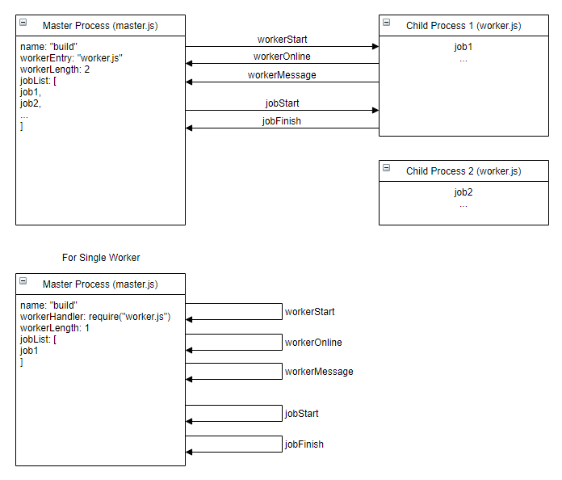

# Multi Process Worker


## Install 
```sh
npm install multi-process-worker --save
```
## Usage
```js
//master.js for master process
const MPW = require("multi-process-worker");
const option = {
    name: "MPW",
    workerEntry: 'worker.js',
    workerLength: 2,
    jobList: [{
        name: "job1",
        jobTimeout: 5000
    }, {
        name: "job2"
    }, {
        name: "error-job"
    }, {
        name: "job3"
    }],
    jobTimeout: 10 * 1000,
    failFast: false,
    workerOption: {
        property: "value"
    },
    onStart: async (option) => {
        console.log('onStart');
    },
    onFinish: async (option) => {
        console.log('onFinish');
        if (option.code !== 0) {
            console.log(option.name + ': jobs stopped with error: ' + option.code);
        }
        process.exit(option.code);
    }
};
const code = await MPW(option);
```

```js
//worker.js for child process
process.on('message', (message) => {
    if (!message) {
        return;
    }
    if (message.type === "workerStart") {
       //workerOption
        console.log(message.data);
        //trigger online event
        process.send({
            type: "workerOnline"
        });
        return;
    }
    //start job
    if (message.type === "jobStart") {
        var job = message.data;
        var jobStartTime = Date.now();
        jobHandler(job).then((exitCode) => {
            job.code = exitCode;
            var cost = (Date.now() - jobStartTime).toLocaleString();
            console.log("finish job and cost " + cost + "ms");
            //finish job
            process.send({
                type: "jobFinish",
                data: job
            });
        });
    }
});
```

## Master Events 
* workerStart
* jobStart

## Worker Events
* workerOnline
* jobFinish

## Debug child process with VSCode
```js
{
    "version": "0.2.0",
    "configurations": [{
        "type": "node",
        "request": "launch",
        "name": "Launch Program",
        "autoAttachChildProcesses": true,
        "cwd": "${workspaceFolder}/test",
        "program": "${workspaceFolder}/test/master.js"
    }]
}
```

## CHANGELOG

+ v1.0.5
  - logCost support worker level only

+ v1.0.4
  - fix jobTimeout

+ v1.0.3
  - add jobTimeout

+ v1.0.2
  - fix min mem